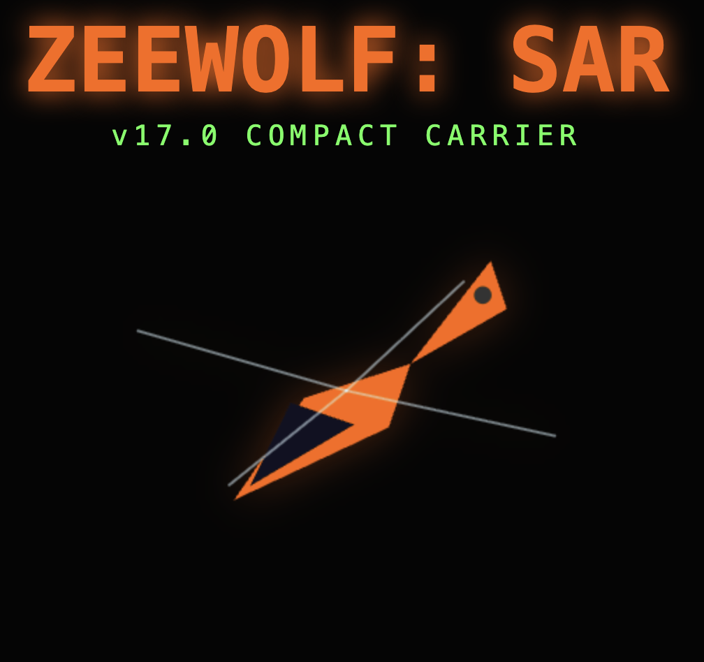

# SAR: Callsign WOLF



An isometric helicopter search-and-rescue simulator built with TypeScript and HTML5 Canvas. Inspired by Zeewolf (Binary Asylum, 1994).

Physics-based flight, winch operations, dynamic weather, procedural terrain, cargo transport — playable in any modern browser, no install required.

---

## Play

**Online:** [ithie.github.io/zeewolf-sar](https://ithie.github.io/zeewolf-sar)

**Local:** open `index.html` directly in any modern browser — no build step or server needed.

---

## Controls

| Key        | Action                                      |
| ---------- | ------------------------------------------- |
| W          | Start engine / Increase collective (ascend) |
| S          | Decrease collective (descend) / Stop engine |
| Arrow Keys | Pitch & Roll                                |
| A / D      | Yaw (turn left / right)                     |
| Q / E      | Winch up / down                             |

---

## Features

- **Isometric renderer** with painter's-algorithm depth sorting, backface culling, and declarative geometry (DEF system)
- **Physics-based flight** — inertia, tilt, wind drift, ground effect
- **Three helicopters** with distinct handling profiles:
    - _Dolphin_ — agile, lightweight, no cargo
    - _Coast-Hawk_ — heavy-lift workhorse, cargo-capable
    - _Atlas_ — tandem rotor, maximum capacity
- **Winch & rescue** — lower a rescuer, pick up survivors, haul them to safety
- **Cargo transport** — sling loads with pendulum physics
- **Fuel management** — refuel at fuel trucks on carrier or pad
- **Dynamic weather** — wind affects flight and rope physics
- **Campaigns** with multiple missions, briefings, and a commander portrait
- **ZSynth soundtrack** — original in-game music composed in the built-in tracker

---

## Campaigns

Select a campaign from the main menu, then choose your airframe. Each campaign has its own mission sequence, terrain, and objectives.

---

## Development

### Prerequisites

```sh
npm install
```

### Dev server + Workbench

```sh
npm run dev
```

Starts the Vite dev server and launches the **Zeewolf Workbench** — an Electron-based development environment with integrated tools (see below).

### Build (single-file HTML for deployment)

```sh
npm run build
```

Produces a self-contained `dist/index.html` with all JS and CSS inlined.

### App Build (iOS App Store)

```sh
VITE_TARGET=app npm run build
```

Produces a single-file bundle without WebRTC/multiplayer and the What's New overlay — suitable for wrapping in a WKWebView (Capacitor / Cordova). Network-sensitive modules are replaced by no-op stubs at build time via Vite aliases; no runtime `if`-guards exist in the source.

| Stubbed module                    | Replaced by         |
| --------------------------------- | ------------------- |
| `src/game/multiplayer/mp-state`   | `mp-stub.ts`        |
| `src/game/multiplayer/sync`       | `mp-stub.ts`        |
| `src/game/multiplayer/mp-mission` | `mp-stub.ts`        |
| `src/game/ui/mp-lobby/mp-lobby`   | `mp-stub.ts`        |
| `src/game/mp-game`                | `mp-game-stub.ts`   |
| `src/game/ui/whats-new/whats-new` | `whats-new-stub.ts` |

A `Content-Security-Policy` header (`default-src 'self' 'unsafe-inline' data:; media-src *;`) is injected into `index.html` automatically for the app build.

### Tests

```sh
npm test
```

### Deploy to GitHub Pages

Deployment runs automatically via GitHub Actions on every push to `main`. Manual deploy:

```sh
npm run deploy
```

---

## Workbench

The Workbench is an Electron app that opens alongside the Vite dev server (`npm run dev`). It provides four integrated tools accessible from the toolbar.

### Mission Editor

Two synchronized windows:

- **Preview** — isometric 3D view (filled left, wireframe right), updates live
- **Map Editor** — paint terrain tiles, place carriers, boats, rescue pads, wind zones, foliage, and NPCs

Missions are saved as JSON to `src/game/campaigns/` and automatically available in the game.

### Model Editor

An interactive DEF (Decoupled Element Facets) editor for the game's isometric geometry:

- Browse and edit all preset models (Hangar, Lighthouse, Sailboat, Carrier, Fuel Truck, all helicopters)
- Add, move, and delete vertices and faces directly on the isometric canvas
- Export DEF JSON for use in the game

### ZSynth Tracker

A step sequencer for composing in-game music:

- **3 drum tracks** (Kick, Snare, Hi-Hat) — toggle pads per step
- **3 synth tracks** — select a note per step (or leave empty)
- Per-track controls: instrument preset, waveform, filter, attack, release, detune
- Global BPM control
- Open / Save / Save As via native file dialogs — songs saved to `src/game/music/`

### Git Integration

Branch display, pull, commit, and push — directly from the workbench toolbar.

---

## Project Structure

```text
src/
  game/
    campaigns/     Mission JSON files
    models/        Isometric geometry definitions (one file per object)
    music/         Song JSON files
    ui/            Menu screens + shared CSS (base, screens)
  shared/          Types and utilities shared across modules (incl. ZSynth library)
  tests/           Unit and snapshot tests
  workbench/
    main/          Electron main process + IPC handlers
    renderer/
      editor/      Mission editor source
      tracker/     ZSynth tracker UI
```

---

## Documentation

- [docs/RELEASE.md](./docs/RELEASE.md) — release process, branching, tagging, app build
- [docs/DEF_SPEC.md](./DEF_SPEC.md) — isometric geometry system (DEF format, SceneRenderer API)
- [docs/SESSION_SYSTEM.md](./docs/SESSION_SYSTEM.md) — session system, rank progression, save code format, GDPR
- [docs/WORKBENCH.md](./docs/WORKBENCH.md) — Workbench architecture and `window.workbench` API
- [docs/CAMPAIGN_FORMAT.md](./docs/CAMPAIGN_FORMAT.md) — campaign and mission JSON format
- [docs/SONG_FORMAT.md](./docs/SONG_FORMAT.md) — ZSynth song JSON format

## Changelog

See [CHANGELOG.md](./CHANGELOG.md).

---

## Inspired By

[Zeewolf](https://www.lemonamiga.com/game/zeewolf) by Binary Asylum (Amiga, 1994).

---

## License

Open source. Feel free to modify and distribute.

Made with ♥ in JavaScript.
